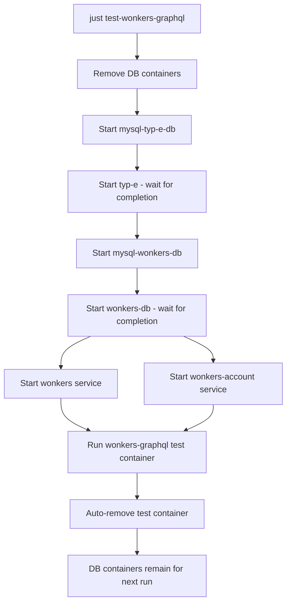

# TinyBots DevTools - Centralized Integration Testing Infrastructure

## Executive Summary

The `devtools` directory provides a **centralized Docker Compose infrastructure** for running integration tests across multiple TinyBots repositories. This replaces the decentralized approach where each repository managed its own complete Docker setup in its `ci/` folder.

### Key Benefits
1. **Selective Container Management**: Only removes stateful containers (databases) between test runs, not all containers
2. **Resource Efficiency**: Reuses running service containers across multiple test runs
3. **Simplified Maintenance**: Single source of truth for service configurations
4. **Faster Test Cycles**: No need to rebuild/restart all infrastructure for each test

---

## Architecture Overview

### Directory Structure
```
tinybots/
├── devtools/
│   ├── docker-compose.yaml       # Centralized service definitions
│   ├── Justfile                  # Main orchestration file
│   ├── justfiles/                # Modular justfile includes
│   │   ├── database.just
│   │   ├── wonkers-graphql.just
│   │   ├── megazord-events.just
│   │   ├── micro-manager.just
│   │   └── ...
│   └── localstack/               # LocalStack initialization scripts
├── wonkers-graphql/
│   └── ci/
│       ├── docker-compose.yml    # Original repo-specific setup (legacy)
│       ├── test.sh               # Original test script with aggressive cleanup
│       └── local-test.sh
├── micro-manager/
│   └── ci/
│       ├── docker-compose.yml
│       └── test.sh
└── ... (other repos)
```

---

## Migration Pattern: From CI to DevTools

### Original Approach (In-Repo CI Folder)

Each repository maintained its own `ci/docker-compose.yml` and test scripts:

**Example: wonkers-graphql/ci/test.sh**
```bash
#!/bin/sh

trap '{
    docker-compose -f ci/docker-compose.yml down
    VOLUMES=$(docker volume ls -q)
    if [ -n "$VOLUMES" ]; then
        docker volume rm $VOLUMES
    fi
}' EXIT

# Login to ECR
aws ecr get-login-password --region eu-central-1 | docker login ...

# Start ALL containers from scratch
docker-compose -f ci/docker-compose.yml up -d mysql-dashboard-db wonkers-db
docker attach $(docker ps -q  --filter=label=service.name=wonkers-db)

docker-compose -f ci/docker-compose.yml up -d mysql-type-db typ-e
docker attach $(docker ps -q  --filter=label=service.name=typ-e)

docker-compose -f ci/docker-compose.yml up -d wonkers
docker-compose -f ci/docker-compose.yml build node --progress=plain
docker-compose -f ci/docker-compose.yml up -d
docker attach $(docker ps -q  --filter=label=wonkers-graphql)
```

**Problems:**
- ❌ Removes ALL containers on exit (aggressive cleanup)
- ❌ Removes ALL volumes including service images
- ❌ Rebuilds everything for each test run
- ❌ Each repo duplicates common service definitions
- ❌ Slow test cycles

### New Approach (Centralized DevTools)

**devtools/docker-compose.yaml** - Single source of truth for all services:
```yaml
name: tinybots-devtools

services:
  # === Shared Database Services ===
  mysql-typ-e-db:
    image: mysql:8.0
    environment:
      MYSQL_DATABASE: tinybots
    ports:
      - "1123:3306"

  typ-e:
    image: 693338167548.dkr.ecr.eu-central-1.amazonaws.com/typ-e:latest
    depends_on:
      - mysql-typ-e-db

  mysql-wonkers-db:
    image: mysql:8.0
    environment:
      MYSQL_DATABASE: dashboard
    ports:
      - "1124:3306"

  wonkers-db:
    image: 693338167548.dkr.ecr.eu-central-1.amazonaws.com/wonkers-db:latest
    depends_on:
      - mysql-wonkers-db

  # === Shared Service Containers ===
  checkpoint:
    image: 693338167548.dkr.ecr.eu-central-1.amazonaws.com/checkpoint:latest
    depends_on:
      typ-e:
        condition: service_completed_successfully

  prowl:
    image: 693338167548.dkr.ecr.eu-central-1.amazonaws.com/prowl:latest
    restart: on-failure:5

  wonkers:
    image: 693338167548.dkr.ecr.eu-central-1.amazonaws.com/wonkers-api:latest

  wonkers-account:
    image: 693338167548.dkr.ecr.eu-central-1.amazonaws.com/wonkers-accounts:latest

  localstack:
    image: localstack/localstack
    environment:
      - SERVICES=sqs

  # === Test Runner Services ===
  wonkers-graphql:
    image: node:22-alpine
    volumes:
      - /Users/kai/work/tinybots/wonkers-graphql:/usr/src/app
    labels:
      - wonkers-graphql
    environment:
      TINYBOTS_DB_HOST: mysql-typ-e-db
      DASHBOARD_DB_HOST: mysql-wonkers-db
      WONKERS_INTERNAL_ADDRESS: http://wonkers:8080
      WONKERS_USER_ACCOUNT_ADDRESS: http://wonkers-account:8080
    working_dir: /usr/src/app
    entrypoint: ["sh", "-c", "yarn test"]
    depends_on:
      typ-e:
        condition: service_completed_successfully
      wonkers-db:
        condition: service_completed_successfully

  micro-manager:
    image: node:22-alpine
    volumes:
      - /Users/kai/work/tinybots/micro-manager:/usr/src/app
    labels:
      - micro-manager
    environment:
      DB_RW_HOST: mysql-typ-e-db
      DB_PORT: 3306
      CHECKPOINT_ADDRESS: http://checkpoint:8080
      PROWL_ADDRESS: http://prowl:8080
    working_dir: /usr/src/app
    entrypoint: ["sh", "-c", "yarn test:only"]
    depends_on:
      typ-e:
        condition: service_completed_successfully

  megazord-events:
    image: node:22-alpine
    volumes:
      - /Users/kai/work/tinybots/megazord-events:/usr/src/app
    labels:
      - megazord-events
    environment:
      DB_RW_HOST: mysql-typ-e-db
      DB_WONKERS_ACCOUNT_RW_HOST: mysql-wonkers-db
      CHECKPOINT_ADDRESS: http://checkpoint:8080
      PROWL_ADDRESS: http://prowl:8080
      AWS_ENDPOINT: http://localstack:4566
    working_dir: /usr/src/app
    entrypoint: ["sh", "-c", "yarn test"]
    depends_on:
      prowl:
        condition: service_started
      typ-e:
        condition: service_completed_successfully
      wonkers-db:
        condition: service_completed_successfully
```

**devtools/justfiles/wonkers-graphql.just** - Selective container management:
```just
#. ------------------------------------- Wonkers GraphQL -------------------------------------
start-wonkers-graphql:
    {{compose}} up -d \
      mysql-typ-e-db typ-e mysql-wonkers-db wonkers-db wonkers wonkers-account
    -{{compose}} logs -f \
      mysql-typ-e-db typ-e mysql-wonkers-db wonkers-db wonkers wonkers-account

test-wonkers-graphql:
    {{compose}} rm -sf mysql-typ-e-db mysql-wonkers-db
    {{compose}} up -d \
          mysql-typ-e-db typ-e mysql-wonkers-db wonkers-db wonkers wonkers-account
    {{compose}} run --rm  --use-aliases wonkers-graphql

log-wonkers-graphql:
    {{compose}} logs -f \
      mysql-typ-e-db typ-e mysql-wonkers-db wonkers-db wonkers wonkers-account
```

**Benefits:**
- ✅ Only removes database containers (`mysql-typ-e-db`, `mysql-wonkers-db`)
- ✅ Reuses service containers (`typ-e`, `wonkers-db`, `checkpoint`, `prowl`, etc.)
- ✅ No volume cleanup needed (Docker Compose manages them)
- ✅ Faster subsequent test runs
- ✅ Shared service definitions reduce duplication

---

## How It Works: Step-by-Step

### 1. Container Lifecycle Management

**Legacy CI Approach (Aggressive):**
```bash
trap '{
    docker-compose down           # Kills ALL containers
    docker volume rm $VOLUMES     # Removes ALL volumes
}' EXIT
```

**DevTools Approach (Selective):**
```bash
just test-wonkers-graphql
# Executes:
# 1. docker compose rm -sf mysql-typ-e-db mysql-wonkers-db  # Only removes DBs
# 2. docker compose up -d [required services]                # Starts only needed services
# 3. docker compose run --rm wonkers-graphql                 # Runs test, auto-removes container
```

### 2. Service Dependencies

Each repository's test runner service defines exactly what it needs:

**wonkers-graphql** needs:
- `mysql-typ-e-db` → `typ-e` (migration runner)
- `mysql-wonkers-db` → `wonkers-db` (migration runner)
- `wonkers` (API service)
- `wonkers-account` (Account service)

**micro-manager** needs:
- `mysql-typ-e-db` → `typ-e` (migration runner)
- `checkpoint` (service)
- `prowl` (service)

**megazord-events** needs:
- `mysql-typ-e-db` → `typ-e`
- `mysql-wonkers-db` → `wonkers-db`
- `checkpoint`, `prowl`
- `localstack` (SQS mock)
- `wonkers`, `wonkers-account`

### 3. Test Execution Flow



---

## Creating Commands for a New Repository

### Step-by-Step Guide

#### Step 1: Analyze Repository CI Configuration

Read the repository's `ci/` folder to understand:
1. **What database(s) does it need?**
   - Check `ci/docker-compose.yml` for `mysql-*` services
   - Example: `mysql-db`, `mysql-typ-e-db`, `mysql-wonkers-db`

2. **What migration runners are required?**
   - Look for `typ-e`, `wonkers-db`, or other DB init services
   - Check their `depends_on` relationships

3. **What external services are needed?**
   - Example: `checkpoint`, `prowl`, `localstack`, `wonkers`, `wonkers-account`
   - Check the test service's `links` and `depends_on` sections

4. **What environment variables are required?**
   - Copy all `environment` settings from the test service
   - Adjust host names to match centralized service names

5. **What is the test command?**
   - Check `entrypoint` and `command` in `ci/docker-compose.yml`
   - Or check `ci/test.sh` script

#### Step 2: Add Service Definition to devtools/docker-compose.yaml

```yaml
  <repo-name>:
    image: node:22-alpine
    volumes:
      - /Users/kai/work/tinybots/<repo-name>:/usr/src/app
    labels:
      - <repo-name>
    environment:
      # Copy all environment variables from ci/docker-compose.yml
      # Adjust service hostnames to match centralized names:
      # mysql-db → mysql-typ-e-db or mysql-wonkers-db
      DB_RW_HOST: mysql-typ-e-db
      DB_PORT: 3306
      CHECKPOINT_ADDRESS: http://checkpoint:8080
    working_dir: /usr/src/app
    entrypoint: ["sh", "-c", "yarn test:only"]
    depends_on:
      typ-e:
        condition: service_completed_successfully
      # Add other required dependencies
```

#### Step 3: Create Justfile Commands

Create `devtools/justfiles/<repo-name>.just`:

```just
# ------------------------------------- <Repo Name> -------------------------------------
start-<repo-name>:
    {{compose}} up -d \
      <list-all-required-services>
    -{{compose}} logs -f \
      <list-all-required-services>

test-<repo-name>:
    {{compose}} rm -sf <list-only-database-containers>
    {{compose}} up -d \
      <list-all-required-services-except-test-runner>
    {{compose}} run --rm --use-aliases <repo-name>

dev-<repo-name>:
    {{compose}} run --rm --service-ports --use-aliases \
      --entrypoint "sh -c 'corepack enable && yarn dev'" <repo-name>

log-<repo-name>:
    {{compose}} logs -f \
      <list-all-required-services>
```

#### Step 4: Import in Main Justfile

Edit `devtools/Justfile`:
```just
import 'justfiles/<repo-name>.just'
```

---

## Example: Adding micro-manager Commands

### Analysis of micro-manager/ci/docker-compose.yml

**Required containers:**
- `mysql-db` → Maps to `mysql-typ-e-db`
- `typ-e` → Migration runner
- `checkpoint` → Service dependency
- `prowl` → Service dependency
- `node` → Test runner (micro-manager)

**Environment variables:**
```yaml
environment:
  DB_RW_HOST: mysql-db          # → mysql-typ-e-db
  DB_PORT: 3306
  CHECKPOINT_ADDRESS: http://checkpoint:8080
  PROWL_ADDRESS: http://prowl:8080
  EVE_ADDRESS: http://eve:8080
  WADSWORTH_ADDRESS: http://wadsworth:8080
  COMMANDER_DATA_ADDRESS: http://commander-data:8080
  REPORTING_ADDRESS: http://reporting:8080
  SIGMUND_ADDRESS: http://sigmund:8080
  WONKERS_ROBOTS_ADDRESS: http://wonkers-robots:8080
  ROBOCOP_ADDRESS: http://robocop:8080
  PUBLIC_BOT_ID: 999999
```

**Test command:**
```yaml
entrypoint: ci/node-verify.sh
```

### Implementation

**Already exists in devtools/docker-compose.yaml:**
```yaml
  micro-manager:
    image: node:22-alpine
    volumes:
      - /Users/kai/work/tinybots/micro-manager:/usr/src/app
    labels:
      - micro-manager
    environment:
      DB_RW_HOST: mysql-typ-e-db
      DB_PORT: 3306
      CHECKPOINT_ADDRESS: http://checkpoint:8080
      PROWL_ADDRESS: http://prowl:8080
      EVE_ADDRESS: http://eve:8080
      WADSWORTH_ADDRESS: http://wadsworth:8080
      COMMANDER_DATA_ADDRESS: http://commander-data:8080
      REPORTING_ADDRESS: http://reporting:8080
      SIGMUND_ADDRESS: http://sigmund:8080
      WONKERS_ROBOTS_ADDRESS: http://wonkers-robots:8080
      ROBOCOP_ADDRESS: http://robocop:8080
      PUBLIC_BOT_ID: 999999
    working_dir: /usr/src/app
    entrypoint: ["sh", "-c", "yarn test:only"]
    depends_on:
      typ-e:
        condition: service_completed_successfully
```

**Create devtools/justfiles/micro-manager.just:**
```just
# ------------------------------------- Micro Manager -------------------------------------
start-micro-manager:
    {{compose}} up -d \
      mysql-typ-e-db typ-e checkpoint prowl
    -{{compose}} logs -f \
      mysql-typ-e-db typ-e checkpoint prowl

test-micro-manager:
    {{compose}} rm -sf mysql-typ-e-db
    {{compose}} up -d \
      mysql-typ-e-db typ-e checkpoint prowl
    {{compose}} run --rm --use-aliases micro-manager

dev-micro-manager:
    {{compose}} run --rm --service-ports --use-aliases \
      --entrypoint "sh -c 'corepack enable && yarn dev'" micro-manager

log-micro-manager:
    {{compose}} logs -f \
      mysql-typ-e-db typ-e checkpoint prowl
```

**Add to devtools/Justfile:**
```just
import 'justfiles/micro-manager.just'
```

---

## Key Differences: Original CI vs DevTools

| Aspect | Original CI (ci/) | Centralized DevTools |
|--------|-------------------|----------------------|
| **Container Management** | Kills ALL containers on exit | Only removes stateful (DB) containers |
| **Volume Management** | Removes ALL volumes | Docker Compose handles automatically |
| **Service Reuse** | Rebuilds everything each time | Reuses running services |
| **Configuration** | Duplicated per repo | Single source of truth |
| **Test Speed** | Slow (full rebuild) | Fast (selective restart) |
| **Working Directory** | Must run from `ci/` folder | Run from anywhere |
| **Docker Compose File** | `ci/docker-compose.yml` | `devtools/docker-compose.yaml` |
| **Network Isolation** | Per-repo networks | Shared `tinybots-devtools` network |

---

## Service Dependency Mapping

### Common Service Name Translations

When migrating from `ci/docker-compose.yml` to `devtools/docker-compose.yaml`:

| CI Name | DevTools Name | Purpose |
|---------|---------------|---------|
| `mysql-db` | `mysql-typ-e-db` | TinyBots main database |
| `mysql-dashboard-db` | `mysql-wonkers-db` | Wonkers/Dashboard database |
| `mysql-type-db` | `mysql-typ-e-db` | Same as above (variant name) |
| `typ-e` | `typ-e` | TinyBots DB migration runner |
| `wonkers-db` | `wonkers-db` | Wonkers DB migration runner |
| `checkpoint` | `checkpoint` | Service (unchanged) |
| `prowl` | `prowl` | Service (unchanged) |
| `wonkers` | `wonkers` | Wonkers API service |
| `wonkers-account` | `wonkers-account` | Wonkers Account service |
| `localstack` | `localstack` | AWS service mock (SQS, etc.) |

### Environment Variable Hostname Updates

When copying environment variables from `ci/docker-compose.yml`:

```diff
# Before (ci/docker-compose.yml)
- DB_RW_HOST: mysql-db
+ DB_RW_HOST: mysql-typ-e-db

- DB_HOST: mysql-type-db
+ DB_HOST: mysql-typ-e-db

- DB_WONKERS_HOST: mysql-dashboard-db
+ DB_WONKERS_HOST: mysql-wonkers-db
```

---

## Justfile Command Patterns

### Standard Commands for Each Repository

1. **`start-<repo>`** - Start all dependencies and tail logs
   - Used for: Development, debugging
   - Keeps services running
   - Tails logs for monitoring

2. **`test-<repo>`** - Run integration tests
   - Used for: CI/CD, local testing
   - Removes DB containers first (fresh state)
   - Runs test container with `--rm` (auto-cleanup)

3. **`dev-<repo>`** - Development mode with hot reload
   - Used for: Active development
   - Exposes ports with `--service-ports`
   - Runs `yarn dev` or equivalent

4. **`log-<repo>`** - View logs for all dependencies
   - Used for: Debugging
   - Follows logs with `-f`

### Command Template

```just
# ------------------------------------- <Repository Name> -------------------------------------

# Start all dependencies for development
start-<repo>:
    {{compose}} up -d \
      <db-container> <migration-runner> <service-1> <service-2>
    -{{compose}} logs -f \
      <db-container> <migration-runner> <service-1> <service-2>

# Run integration tests (removes DBs first for fresh state)
test-<repo>:
    {{compose}} rm -sf <db-containers-only>
    {{compose}} up -d \
      <all-dependencies-except-test-runner>
    {{compose}} run --rm --use-aliases <repo>

# Development mode with hot reload and port exposure
dev-<repo>:
    {{compose}} run --rm --service-ports --use-aliases \
      --entrypoint "sh -c 'corepack enable && yarn dev'" <repo>

# Debugging: view logs without starting new containers
log-<repo>:
    {{compose}} logs -f \
      <all-dependencies>
```

---

## Best Practices

### 1. Selective Container Removal
- **DO**: Only remove containers that hold state (databases)
- **DON'T**: Remove service containers unnecessarily
- **Reason**: Service containers (like `typ-e`, `checkpoint`, `prowl`) can be reused across test runs

```just
# ✅ Good: Only remove databases
test-wonkers-graphql:
    {{compose}} rm -sf mysql-typ-e-db mysql-wonkers-db
    # ... rest of command

# ❌ Bad: Removes everything
test-wonkers-graphql:
    {{compose}} down
    # ... rest of command
```

### 2. Dependency Declaration
- Use `depends_on` with `condition: service_completed_successfully` for migration runners
- This ensures databases are fully migrated before tests run

```yaml
wonkers-graphql:
  depends_on:
    typ-e:
      condition: service_completed_successfully  # Wait for migrations
    wonkers-db:
      condition: service_completed_successfully  # Wait for migrations
```

### 3. Volume Management
- Let Docker Compose handle volumes automatically
- Use named volumes for Maven caches: `typ-e-maven-cache`, `wonkers-db-maven-cache`
- No manual volume cleanup needed

### 4. Network Configuration
- All services share the `tinybots-devtools` network
- Simplified service discovery (services can reference each other by name)
- Custom subnet: `172.16.0.0/24` for consistency

### 5. Port Exposure
- Expose ports only for services that need external access
- Use `--service-ports` in dev mode to access application ports

---

## Troubleshooting Guide

### Issue: Tests fail because database isn't ready

**Symptom:** Test starts before migrations complete

**Solution:** Check `depends_on` configuration
```yaml
depends_on:
  typ-e:
    condition: service_completed_successfully  # ← Must wait for completion
  wonkers-db:
    condition: service_completed_successfully
```

### Issue: Service can't connect to database

**Symptom:** Connection errors in test logs

**Solution:** Verify hostname in environment variables
```yaml
environment:
  DB_RW_HOST: mysql-typ-e-db  # ← Must match service name in docker-compose.yaml
```

### Issue: Port conflicts

**Symptom:** "port already in use" errors

**Solution:** Check port mappings in `docker-compose.yaml`
```yaml
ports:
  - "1123:3306"  # ← Unique host port for each DB
```

### Issue: Stale data between test runs

**Symptom:** Tests pass/fail inconsistently

**Solution:** Ensure DB containers are removed in test command
```just
test-<repo>:
    {{compose}} rm -sf mysql-typ-e-db mysql-wonkers-db  # ← Removes containers AND volumes
```

### Issue: ECR authentication fails

**Symptom:** "authentication required" when pulling images

**Solution:** Run ECR login command (in `start-db` recipe)
```bash
aws ecr get-login-password --region eu-central-1 | docker login ...
```

---

## AI Agent Instructions

When asked to create DevTools commands for a new repository:

### 1. Context Gathering Phase
- Read `<repo>/ci/docker-compose.yml` completely
- Read `<repo>/ci/test.sh` or `<repo>/ci/local-test.sh`
- Identify all service dependencies
- Note all environment variables
- Understand the test execution command

### 2. Mapping Phase
- Map CI service names to DevTools service names (see Service Dependency Mapping table)
- Identify which services already exist in `devtools/docker-compose.yaml`
- Identify which services need to be added
- Update environment variable hostnames

### 3. Implementation Phase
- Check if service definition exists in `devtools/docker-compose.yaml`
  - If YES: Verify configuration matches requirements
  - If NO: Add new service definition
- Create `devtools/justfiles/<repo-name>.just` with all 4 standard commands
- Add import to `devtools/Justfile`

### 4. Verification Phase
- Ensure database containers are in the `rm -sf` command
- Verify all dependencies are listed in the correct order
- Check that service names match between docker-compose and justfile
- Validate environment variable hostnames

### 5. Documentation
- Document any special requirements or deviations
- Note if additional services were needed
- Explain any non-standard configuration

---

## Examples: Complete Implementations

### Example 1: wonkers-graphql (Comprehensive)

**Services needed:**
- mysql-typ-e-db (DB)
- typ-e (migration)
- mysql-wonkers-db (DB)
- wonkers-db (migration)
- wonkers (service)
- wonkers-account (service)

**devtools/justfiles/wonkers-graphql.just:**
```just
#. ------------------------------------- Wonkers GraphQL -------------------------------------
start-wonkers-graphql:
    {{compose}} up -d \
      mysql-typ-e-db typ-e mysql-wonkers-db wonkers-db wonkers wonkers-account
    -{{compose}} logs -f \
      mysql-typ-e-db typ-e mysql-wonkers-db wonkers-db wonkers wonkers-account

test-wonkers-graphql:
    {{compose}} rm -sf mysql-typ-e-db mysql-wonkers-db
    {{compose}} up -d \
          mysql-typ-e-db typ-e mysql-wonkers-db wonkers-db wonkers wonkers-account
    {{compose}} run --rm  --use-aliases wonkers-graphql

log-wonkers-graphql:
    {{compose}} logs -f \
      mysql-typ-e-db typ-e mysql-wonkers-db wonkers-db wonkers wonkers-account
```

### Example 2: megazord-events (With LocalStack)

**Services needed:**
- mysql-typ-e-db, typ-e
- mysql-wonkers-db, wonkers-db
- checkpoint, prowl
- wonkers, wonkers-account
- localstack (for SQS)

**devtools/justfiles/megazord-events.just:**
```just
# ------------------------------------- Megazord Events. -------------------------------------
dev-megazord-events:
    {{compose}} run --rm --service-ports  --use-aliases \
      --entrypoint "sh -c 'corepack enable && yarn start'" megazord-events

debug-megazord-events:
    {{compose}} run --rm --service-ports  --use-aliases \
      --entrypoint "sh -c 'corepack enable && yarn dev'" megazord-events

start-megazord-events:
    {{compose}} up -d \
      mysql-typ-e-db typ-e mysql-wonkers-db wonkers-db localstack checkpoint prowl wonkers wonkers-account

test-megazord-events:
    {{compose}} rm -sf mysql-typ-e-db mysql-wonkers-db localstack
    {{compose}} up -d \
      mysql-typ-e-db mysql-wonkers-db localstack checkpoint prowl wonkers wonkers-account wonkers-db
    {{compose}} run --rm --use-aliases megazord-events

log-megazord-events:
    -{{compose}} logs -f \
          mysql-typ-e-db typ-e mysql-wonkers-db wonkers-db localstack checkpoint prowl wonkers wonkers-account
```

**Note:** LocalStack is also removed in test command because it stores queue state

### Example 3: micro-manager (Minimal Dependencies)

**Services needed:**
- mysql-typ-e-db, typ-e
- checkpoint, prowl

**devtools/justfiles/micro-manager.just:**
```just
# ------------------------------------- Micro Manager -------------------------------------
start-micro-manager:
    {{compose}} up -d \
      mysql-typ-e-db typ-e checkpoint prowl
    -{{compose}} logs -f \
      mysql-typ-e-db typ-e checkpoint prowl

test-micro-manager:
    {{compose}} rm -sf mysql-typ-e-db
    {{compose}} up -d \
      mysql-typ-e-db typ-e checkpoint prowl
    {{compose}} run --rm --use-aliases micro-manager

dev-micro-manager:
    {{compose}} run --rm --service-ports --use-aliases \
      --entrypoint "sh -c 'corepack enable && yarn dev'" micro-manager

log-micro-manager:
    {{compose}} logs -f \
      mysql-typ-e-db typ-e checkpoint prowl
```

---

## Glossary

- **Migration Runner**: Service that initializes and migrates databases (e.g., `typ-e`, `wonkers-db`)
- **Stateful Container**: Container that stores data that should be reset between tests (databases, localstack)
- **Service Container**: Stateless service that can be reused across test runs (checkpoint, prowl, wonkers)
- **Test Runner**: The ephemeral container that executes tests (e.g., `wonkers-graphql` service)
- **Selective Cleanup**: Strategy of removing only stateful containers, not all containers
- **Dependency Condition**: Docker Compose feature to wait for services to complete before starting dependent services

---

## Version History

- **v1.0 (2025-12-31)**: Initial documentation
  - Documented wonkers-graphql migration pattern
  - Established standards for creating new repository commands
  - Documented micro-manager, megazord-events as additional examples

---

## Related Documentation

- `devtools/Justfile` - Main orchestration file
- `devtools/docker-compose.yaml` - Complete service definitions
- `/devdocs/tinybots/OVERVIEW.md` - Global TinyBots standards
- `<repo>/ci/docker-compose.yml` - Original repository-specific configurations (legacy)

---

## Quick Reference: Command Checklist

When adding a new repository:

- [ ] Read `<repo>/ci/docker-compose.yml`
- [ ] Read `<repo>/ci/test.sh`
- [ ] Identify all dependencies (DBs, services)
- [ ] Check if services exist in `devtools/docker-compose.yaml`
- [ ] Add service definition if needed
- [ ] Map CI service names to DevTools names
- [ ] Update environment variable hostnames
- [ ] Create `devtools/justfiles/<repo>.just` with 4 commands
- [ ] Add import to `devtools/Justfile`
- [ ] Test `just test-<repo>` command
- [ ] Verify DB containers are removed in test command
- [ ] Document any special requirements
